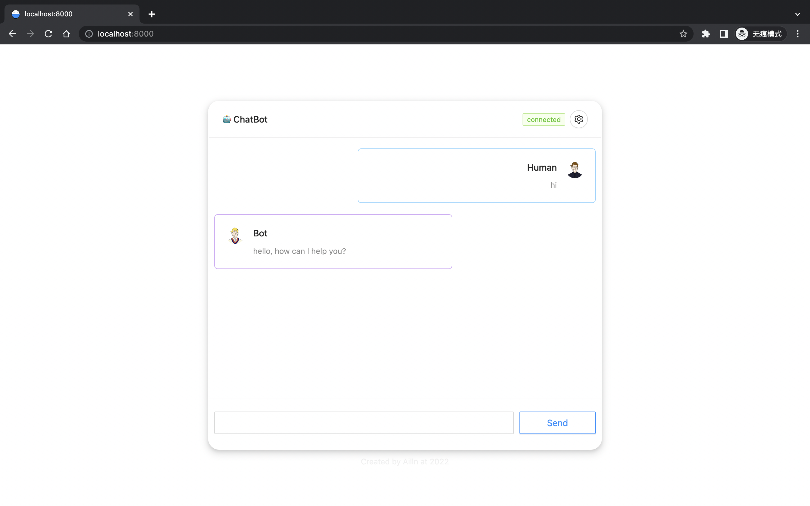

# fuzi view

[](https://github.com/Ailln/fuzi-view/blob/main/LICENSE)
[](https://github.com/Ailln/fuzi-view/stargazers)
[](https://github.com/Ailln/fuzi-view/network/members)

🤖️ 聊天机器人——`夫子`的交互界面。

## 1 预览



[>> 点我立即尝试 DEMO <<](https://fuzi.ailln.com)

## 2 快速上手

```bash
git clone https://github.com/Ailln/fuzi-view.git

cd fuzi-view
npm install

npm run start
# open http://localhost:8000
```

## 3 部署

```bash
cd fuzi-view
docker build -t fuzi-view:1.0.0 .

docker run -d -p 8000:80 --name fuzi-view fuzi-view:1.0.0
# open http://localhost:8000

# 部署在 k8s 中
kubectl apply -f deploy/deployment.yaml
# open http://localhost:30100
```

## 4 参考

- [Ant Design](https://ant.design/)
- [React](https://reactjs.org/)

## 5 许可证

[](./LICENSE)
[](https://github.com/Ailln/award)

## 6 交流

请添加微信号：`Ailln_`，备注「fuzi」，我邀请你进入交流群。
