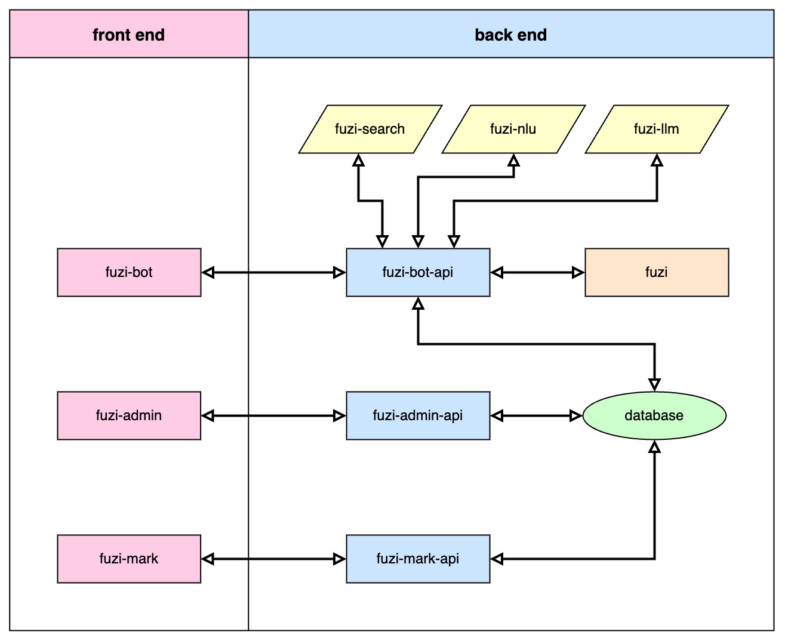
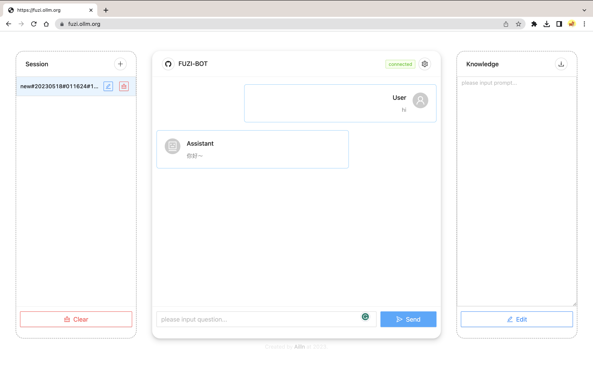

# FUZI BOT

[](https://github.com/Ailln/fuzi-bot/blob/main/LICENSE)
[](https://github.com/Ailln/fuzi-bot/stargazers)
[](https://github.com/Ailln/fuzi-bot/network/members)

🤖️ 聊天机器人——`夫子`的聊天交互界面。

## 1 简介

`夫子` 聊天机器人有 10 个模块组成：
1. [fuzi-bot](https://github.com/Ailln/fuzi-bot): 聊天界面模块，与用户进行交互。
2. [fuzi-bot-api](https://github.com/Ailln/fuzi-bot-api): 聊天接口模块，与其他后端模块通信。
3. [fuzi-search](https://github.com/Ailln/fuzi-search): 语义检索模块，快速查找已有问题。
4. [fuzi-nlu](https://github.com/Ailln/fuzi-nlu): 自然语言处理模块，理解用户的问题。
5. fuzi-llm: 大语言模型模块，针对非高频常识问题进行回复。
6. fuzi: 对话管理模块，推断用户的意图。
7. fuzi-admin: 后台管理模块，管理机器人的设置。
8. fuzi-admin-api: 后台管理接口，与其他后端模块通信。
9. fuzi-mark: 数据标注模块，标注用户的问题。
10. fuzi-mark-api: 数据标注接口，与其他后端模块通信。



## 2 预览



[>> 点我立即尝试 <<](https://fuzi.ollm.org)

## 3 快速上手

```bash
git clone https://github.com/Ailln/fuzi-bot.git

cd fuzi-bot
# 本地系统环境开发
npm install --registry=https://registry.npmmirror.com
npm run start
# 打开 http://localhost:8000

# 本地 docker 环境开发
docker run -it --name fuzi-bot -v $PWD:/app \
  -p 8000:8000 node:16.18.1-slim bash
cd /app
npm install --registry=https://registry.npmmirror.com
npm run start
```

## 4 部署

### 4.1 Docker

```bash
cd fuzi-bot

docker build -t fuzi-bot:1.0.0 .
docker run -d --restart=always --name fuzi-bot \
  -p 8000:80 fuzi-bot:1.0.0
# 打开 http://localhost:8000
```

### 4.2 Kubernetes

```bash
# 需要 docker registry
docker tag fuzi-bot:1.0.0 192.168.2.101:5000/fuzi-bot:1.0.0
docker push 192.168.2.101:5000/fuzi-bot:1.0.0

cd fuzi-bot
kubectl apply -f deploy/deployment.yaml
# 打开 http://localhost:30100
```

## 5 TODO

- [ ] 右侧卡片信息展示；
- [ ] 接入开源大语言模型；

## 6 参考

- [Ant Design](https://ant.design/)
- [React](https://reactjs.org/)

## 7 许可证

[](./LICENSE)
[](https://github.com/Ailln/award)
