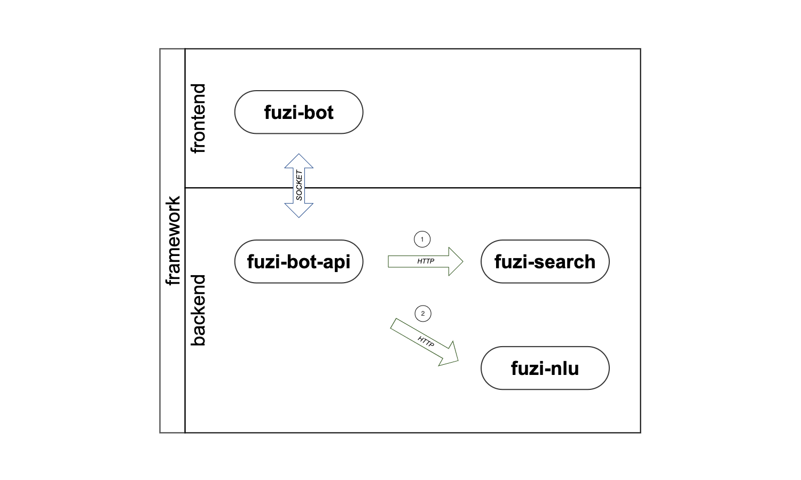
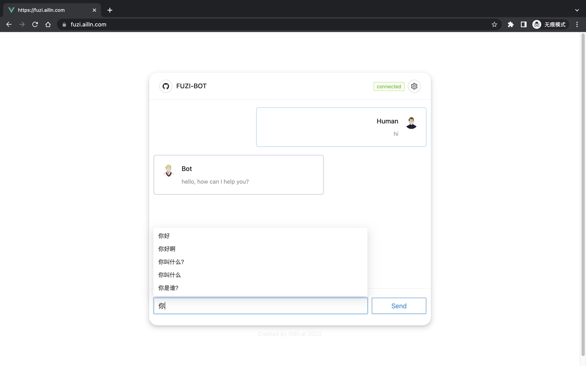

# FUZI BOT

[](https://github.com/Ailln/fuzi-bot/blob/main/LICENSE)
[](https://github.com/Ailln/fuzi-bot/stargazers)
[](https://github.com/Ailln/fuzi-bot/network/members)

🤖️ 聊天机器人——`夫子`的聊天交互界面。

## 1 简介

`夫子` 聊天机器人有 8 个模块组成：
1. [fuzi-bot](https://github.com/Ailln/fuzi-bot): 聊天界面模块，与用户进行交互。
2. [fuzi-bot-api](https://github.com/Ailln/fuzi-bot-api): 聊天接口模块，与其他后端模块通信。
3. [fuzi-nlu](https://github.com/Ailln/fuzi-nlu): 自然语言处理模块，理解用户的问题。
4. [fuzi-search](https://github.com/Ailln/fuzi-search): 语义检索模块，快速查找已有问题。
5. fuzi: 对话管理模块，推断用户的意图。
6. fuzi-admin: 后台管理模块，管理机器人的设置。
7. fuzi-admin-api: 后台管理接口，与其他后端模块通信。
8. fuzi-mark: 数据标注模块，标注用户的问题。



## 2 预览



[>> 点我立即尝试 <<](https://fuzi.ailln.com)

## 3 快速上手

```bash
git clone https://github.com/Ailln/fuzi-bot.git

cd fuzi-bot
# 安装依赖
npm install

npm run start
# 打开 http://localhost:8000
```

## 4 部署

### 4.1 Docker

```bash
cd fuzi-bot

docker build -t fuzi-bot:1.0.1 .

docker run -d -p 8000:80 --name fuzi-bot fuzi-bot:1.0.1
# 打开 http://localhost:8000
```

### 4.2 Kubernetes

```bash
cd fuzi-bot

docker tag fuzi-bot:1.0.1 192.168.2.101:5000/fuzi-bot:1.0.1
docker push 192.168.2.101:5000/fuzi-bot:1.0.1

kubectl apply -f deploy/deployment.yaml
# 打开 http://localhost:30100
```

## 5 参考

- [Ant Design](https://ant.design/)
- [React](https://reactjs.org/)

## 6 许可证

[](./LICENSE)
[](https://github.com/Ailln/award)

## 7 交流

请添加微信号：`Ailln_`，备注「fuzi」，我邀请你进入交流群。
